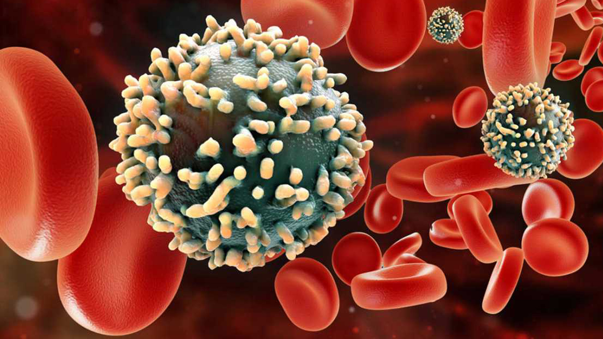

```{r setup, include = FALSE}
knitr::opts_chunk$set(echo = TRUE)
```

## <span style = "color: LightCoral;"> Introducción </span>

El VIH (virus de la inmunodeficiencia humana) es un virus que ataca el sistema inmunitario del cuerpo, se transmite a través de la sangre y actualmente no tiene cura, únicamente se puede controlar con una adecuada atención médica.



### *Objetivos*

- Investigar si existe relación entre el contagio del virus y el ambiente social.

## <span style = "color: LightCoral;"> Métodos </span>

### *Carga de paquetes*

Para llevar a cabo la investigación se ha hecho uso de algunos paquetes necesarios para leer, modificar, unir y plasmar los datos de forma visual a modo de tablas y gráficos.

```{r, warning = FALSE, message = FALSE}
library(readr)
library(dplyr)
library(ggplot2)
library(tidyverse)
library(DT)
```

### *Carga de datos*

Los datos que he utilizado estaban contenidos en 2 tablas, "Registro_regional_de_sida" y "Registro_nuevas_infecciones_por_vih". Los obtuve a travésde la sección de datos abiertos de la página de la [Junta de Castilla y León](https://datosabiertos.jcyl.es/web/es/datos-abiertos-castilla-leon.html). 
Ambas han sido descargadas en formato CSV.

#### <span style = "color: #f7bbbb;"> registro_regional_de_sida </span>

Esta tabla contiene el Sexo, Provincia, País, Edad, Código, Grupo de riesgo y Año de diagnóstico del VIH a personas que residen en alguna de las provincias de Castilla y León entre 1982 y 2009.

```{r, warning = FALSE, message = FALSE}

registro_regional_de_sida <- read_delim("INPUT/DATA/registro-regional-de-sida.csv",
                                  delim = ";", escape_double = FALSE, trim_ws = TRUE)

datatable(registro_regional_de_sida)
```


#### <span style = "color: #f7bbbb;"> registro_nuevas_infecciones_por_vih </span>

Se esta otra tabla obtenemos unos datos bastante similares a los anteriores, Sexo, Provincia, País, Edad, Código y Grupo de riesgo y Año de diagnóstico entre otros, del VIH a personas que habitan en cualquiera de las provincias de Castilla y León entre 2009 y 2021.

```{r, warning = FALSE, message = FALSE}

registro_nuevas_infecciones_por_vih <- read_delim("INPUT/DATA/registro-nuevas-infecciones-por-vih.csv",col_types = cols(
                                        Año = readr::col_integer(),
                                        "VIH" = readr::col_integer()),
                                        delim = ";", escape_double = FALSE, trim_ws = TRUE)

datatable(registro_nuevas_infecciones_por_vih)
```

### *Exploración de los datos*

Una vez cargadas, pasamos a transformar las tablas originales cambiando los nombres de las columnas por otros más correctos semánticamente, recolocamos, seleccionamos y filtramos los datos que sean de nuestro interés.

```{r, warning = FALSE, message = FALSE}
registroRegionalSida <- rename(.data = registro_regional_de_sida, Año = "Año de diagnóstico", Edad = "Edad años", Codigo_Riesgo = "Código Grupo de riesgo", Grupo_Riesgo = "Grupo de riesgo", Provincia = "provincia")%>%
  relocate(., "Edad meses", .after = Grupo_Riesgo)%>%
  relocate(.,"País de origen", .after = Grupo_Riesgo)%>%
  dplyr::filter(Año < 2009)%>%
  select(., Año:Grupo_Riesgo)%>%
  mutate(Provincia = factor(Provincia, levels = c("Burgos", "León", "Avila", "Zamora", "Salamanca", "Segovia", "Valladolid", "Palencia", "Soria"), labels = c("BURGOS", "LEON", "AVILA", "ZAMORA", "SALAMANCA", "SEGOVIA", "VALLADOLID", "PALENCIA", "SORIA")))


datatable(registroRegionalSida)
```

```{r, warning = FALSE, message = FALSE}
registroNuevasInfecciones <- rename(.data = registro_nuevas_infecciones_por_vih, Provincia = "Provincia residencia", Codigo_Riesgo = "Código Grupo de riesgo asignado", Grupo_Riesgo = "grupo riesgo", Año = "VIH")%>%
  relocate(., "País de nacimiento (si no es España)", .before = "Estado clínico de la infección por VIH")%>%
  select(., Provincia:Grupo_Riesgo)%>%
  mutate(Grupo_Riesgo = factor(Grupo_Riesgo, levels = c("Grupo de riesgo desconocido", "Hijo de madre a riesgo", "Personas que se inyectan drogas", "Personas que se inyectan drogas / Varones homo/bisexuales", "Receptores de hemoderivados", "Receptor trasfusiones", "Relaciones Heterosexuales", "Varones homosexuales / bisexuales"), labels = c("Grupo de riesgo desconocido", "Hijo de madre a riesgo", "Personas que se inyectan drogas", "Personas que se inyectan drogas / Varones homo/bisexuales", "Receptores de hemoderivados", "Receptores de transfusión", "Relaciones Heterosexuales", "Varones homosexuales / bisexuales")))

datatable(registroNuevasInfecciones)
```
A partir de la información contenida en estas tablas podemos ver gráficamente cómo se diferencian los grupos de riesgo por provincia y por año.
```{r}
casosAntiguos <- ggplot(data = registroRegionalSida, aes(x = Provincia)) +
  geom_bar(aes(fill = Grupo_Riesgo), position = "dodge")+
  theme_classic()+
  theme(axis.text.x = element_text(angle = 45, hjust = 1))+
  labs(x = "Provincias", y = "Casos", title = "Casos registrados entre 1982 y 2009", colour = "Grupo de Riesgo" )

print(casosAntiguos)

jpeg("casosAntiguos.jpeg", quality = 75)
plot(rnorm(20))
dev.off()
```

```{r}

ggplot(data = registroNuevasInfecciones, aes(x = Provincia)) +
  geom_bar(aes(fill = Grupo_Riesgo), position = "dodge")+
  theme(axis.text.x = element_text(angle = 45, hjust = 1))
```
Si unimos las dos tablas podemos obtener otro tipo de información.
```{r}
union <- full_join(x = registroRegionalSida, y = registroNuevasInfecciones)

datatable(union)
```

```{r}
ggplot(data = union, aes(x = Año, y = Edad))+
 geom_point(aes(colour = factor(Sexo)))
```

```{r}
casos_grafico <- union%>%
  group_by(Provincia, Sexo)

ggplot(data = casos_grafico, aes(x = Provincia, y = Año))+
  geom_point(aes(colour = factor(Sexo)))+
  theme(axis.text.x = element_text(angle = 45, hjust = 1))
```

```{r}
union <- full_join(x = registroRegionalSida, y = registroNuevasInfecciones)

datatable(union)
```

```{r}
promedioAntiguos <- registroRegionalSida%>%
  group_by(Grupo_Riesgo, Sexo)%>%
  summarise(across(c(Año), ~ trunc(mean(.x, na.rm = TRUE))))%>%
  arrange(Año)

datatable(promedioAntiguos)
```

```{r}
promedioNuevos <- registroNuevasInfecciones%>%
  group_by(Grupo_Riesgo, Sexo)%>%
  summarise(across(c(Año), ~ trunc(mean(.x, na.rm = TRUE))))%>%
  arrange(Año)

datatable(promedioNuevos) 
```

```{r}
unionpromedios <- full_join(x = promedioAntiguos, y = promedioNuevos)

datatable(unionpromedios)
```

```{r}
ggplot(data = unionpromedios, aes(x = Sexo, y = Año, group = Grupo_Riesgo, color = Grupo_Riesgo))+
 geom_line()

```
